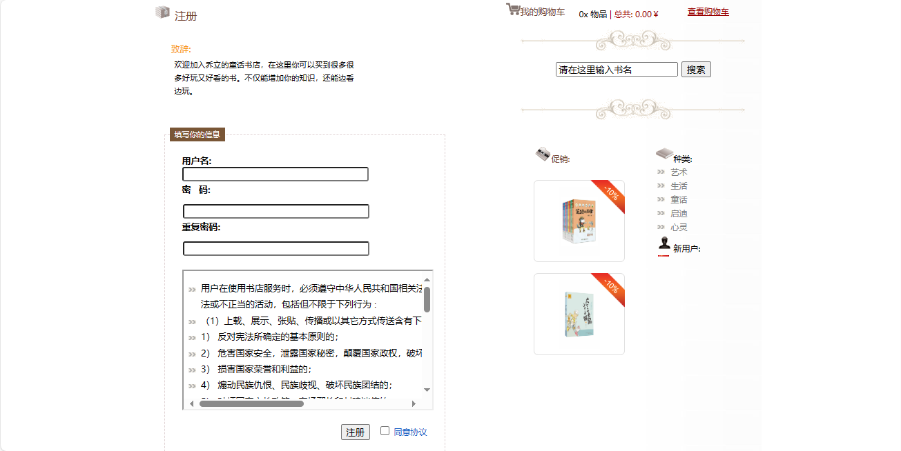
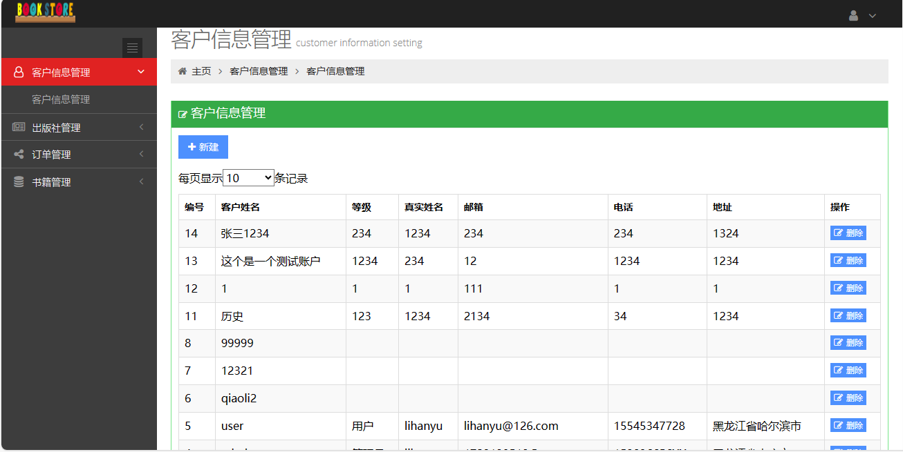
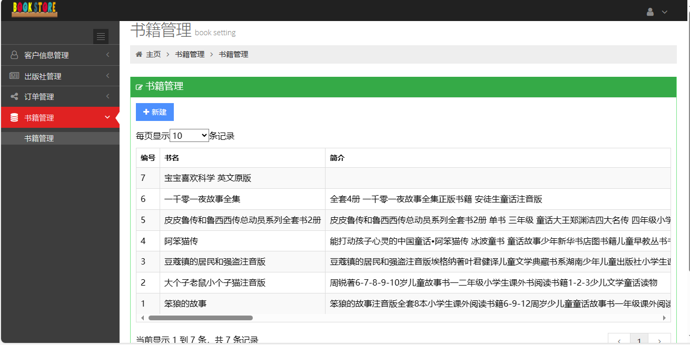
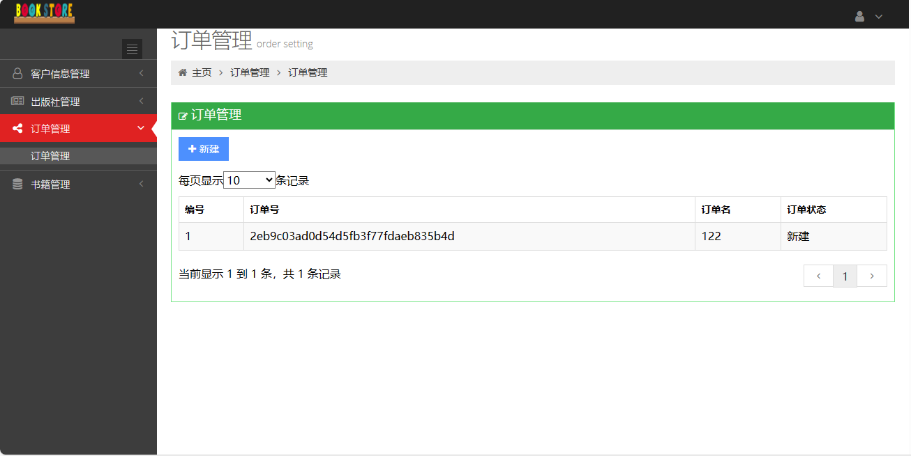

<h1 align="center">基于SSM的童话书店系统</h1>

- <b>完整代码获取地址：从戎源码网 ([https://armycodes.com/](https://armycodes.com/))</b>
- <b>技术探讨、资料分享，请加QQ群：692619798</b> 
- <b>作者微信：19941326836  QQ：952045282</b> 
- <b>承接计算机毕业设计、Java毕业设计、Python毕业设计、深度学习、机器学习</b>
- <b>选题+开题报告+任务书+程序定制+安装调试+论文+答辩ppt 一条龙服务</b>
- <b>所有选题地址 ([https://github.com/YuLin-Coder/AllProjectCatalog](https://github.com/YuLin-Coder/AllProjectCatalog)) </b>

## 项目介绍

基于SSM的童话书店系统：前端jsp、ztree、bootstrap、jquery，后端 spring、springmvc、mybatis，系统角色分为：用户、管理员，管理员在后台编辑书籍信息，前端用户浏览图书信息，在线下单、购物车结算等；主要功能如下：

### 用户：

- 基本功能：登录、注册、注销、账号信息查看、信息修改
- 核心功能：好书一瞥、特别推荐、图书详情查看、添加购物车、在线结算、图书搜索、图书类别展示、图书列表分页展示、促销列表展示
- 次要功能：留言板、提交留言、留言列表展示

### 管理员：

- 客户信息管理：客户列表、新建客户信息、客户信息删除
- 出版社管理：出版社列表、新建出版社、出版社删除
- 订单管理：订单列表、新建订单
- 书籍管理：书籍列表、新建书籍、书籍删除

## 环境

- <b>IntelliJ IDEA 2009.3</b>

- <b>Mysql 5.7.26</b>

- <b>Tomcat 7.0.73</b>

- <b>JDK 1.8</b>

## 运行截图

